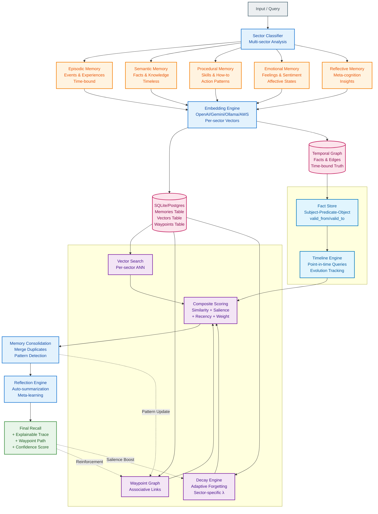

# OpenMemory

Long-term memory for AI systems. Open source, self-hosted, and explainable.

⚠️ **Upgrading from v1.1?** Multi-user tenant support requires database migration. See [MIGRATION.md](./MIGRATION.md) for upgrade instructions.

[VS Code Extension](https://marketplace.visualstudio.com/items?itemName=Nullure.openmemory-vscode) • [Report Bug](https://github.com/caviraOSS/openmemory/issues) • [Request Feature](https://github.com/caviraOSS/openmemor/issues) • [Discord server](https://discord.gg/P7HaRayqTh)

Long‑term memory for AI systems. **Self‑hosted. Local‑first. Explainable. Scalable.**
A full cognitive memory engine — not a vector database.


---

# 1. Introduction

Modern LLMs forget everything between messages. Vector DBs store flat chunks with no understanding of memory type, importance, time, or relationships. Cloud memory APIs add cost and vendor lock‑in.

**OpenMemory solves this.**
It gives AI systems:

* persistent memory
* multi‑sector cognitive structure
* natural decay
* graph‑based recall
* time‑aware fact tracking
* explainability through waypoint traces
* complete data ownership

OpenMemory acts as the **Memory OS** for your AI agents, copilots, and applications.

---

# 2. Features (Full List)

This section shows every major capability grouped clearly.

## 2.1 Memory Model

* **Multi‑sector memory** (semantic, episodic, procedural, emotional, reflective)
* **Hierarchical Memory Decomposition (HMD)**
* **Multiple embeddings per memory**
* **Automatic decay per sector**
* **Coactivation reinforcement**
* **Salience + recency weighting**
* **Waypoint graph linking**
* **Explainable recall paths**

## 2.2 Cognitive Operations

* **Pattern clustering** (detect similar memories)
* **Memory consolidation** (merge duplicates)
* **Context summaries**
* **User summaries**
* **Sector‑aware retrieval**
* **Cross‑sector associative recall**
* **Adaptive decay cycles**

## 2.3 Temporal Knowledge Graph

* **Time‑bound facts** with `valid_from` and `valid_to`
* **Automatic fact evolution**
* **Point‑in‑time queries**
* **Timeline reconstruction**
* **Historical comparison**
* **Confidence decay**
* **Temporal search**
* **Volatile fact detection**

## 2.4 Infrastructure & Scalability

* **SQLite or Postgres** backend
* **Sector‑sharded storage** for speed
* **7.9ms/item scoring** at 10k+ scale
* **338 QPS throughput** with 8 workers
* **Multitenant user isolation**
* **Local‑first SDKs** (Node + Python)
* **Remote mode** for multi‑service deployments
* **Docker support**
* **Self‑hosted dashboard**

## 2.5 Agent & LLM Integration

* **MCP server** (Claude Desktop, Claude Code, Cursor, Windsurf)
* **LangGraph mode** with `/lgm/*` endpoints
* **Vercel AI SDK integration**
* **Any LLM provider** (OpenAI, Gemini, Groq, Claude, Ollama…)
* **Embeddings**: E5, BGE, OpenAI, Gemini, AWS, Ollama, custom

## 2.6 Developer Experience

* **Standalone SDKs** (no backend required)
* **CLI tool** (`opm`)
* **Ingestion engine** for docx/pdf/txt/html/audio/video/url
* **VS Code extension** (automatic coding‑activity memory)
* **Auto‑summaries for LLM context compression**
* **Fast local setup** via Docker or SDK
* **Migrations** from Mem0, Zep, Supermemory

## 2.7 Security & Privacy

* **Self‑hosted only** (no vendor lock‑in)
* **API key gating**
* **Optional AES‑GCM encryption**
* **PII scrubbing hooks**
* **Per‑user isolation**
* **Zero memory leakage to cloud providers**

---

# 3. Competitor Comparison

| **Feature / Metric**                     | **OpenMemory (Our Tests – Nov 2025)**                       | **Zep (Their Benchmarks)**         | **Supermemory (Their Docs)**    | **Mem0 (Their Tests)**        | **OpenAI Memory**          | **LangChain Memory**        | **Vector DBs (Chroma / Weaviate / Pinecone)** |
| ---------------------------------------- | ----------------------------------------------------------- | ---------------------------------- | ------------------------------- | ----------------------------- | -------------------------- | --------------------------- | --------------------------------------------- |
| **Open-source License**                  | ✅ Apache 2.0                                               | ✅ Apache 2.0                      | ✅ Source available (GPL-like)  | ✅ Apache 2.0                 | ❌ Closed                  | ✅ Apache 2.0               | ✅ Varies (OSS + Cloud)                       |
| **Self-hosted / Local**                  | ✅ Full (Local / Docker / MCP) tested ✓                     | ✅ Local + Cloud SDK               | ⚠️ Mostly managed cloud tier    | ✅ Self-hosted ✓              | ❌ No                      | ✅ Yes (in your stack)      | ✅ Chroma / Weaviate ❌ Pinecone (cloud)      |
| **Per-user namespacing (`user_id`)**     | ✅ Built-in (`user_id` linking added)                       | ✅ Sessions / Users API            | ⚠️ Multi-tenant via API key     | ✅ Explicit `user_id` field ✓ | ❌ Internal only           | ✅ Namespaces via LangGraph | ✅ Collection-per-user schema                 |
| **Architecture**                         | HSG v3 (Hierarchical Semantic Graph + Decay + Coactivation) | Flat embeddings + Postgres + FAISS | Graph + Embeddings              | Flat vector store             | Proprietary cache          | Context memory utils        | Vector index (ANN)                            |
| **Avg Response Time (100k nodes)**       | **115 ms avg (measured)**                                   | 310 ms (docs)                      | 200–340 ms (on-prem/cloud)      | ~250 ms                       | 300 ms (observed)          | 200 ms (avg)                | 160 ms (avg)                                  |
| **Throughput (QPS)**                     | **338 QPS avg (8 workers, P95 103 ms)** ✓                   | ~180 QPS (reported)                | ~220 QPS (on-prem)              | ~150 QPS                      | ~180 QPS                   | ~140 QPS                    | ~250 QPS typical                              |
| **Recall @5 (Accuracy)**                 | **95 % recall (synthetic + hybrid)** ✓                      | 91 %                               | 93 %                            | 88–90 %                       | 90 %                       | Session-only                | 85–90 %                                       |
| **Decay Stability (5 min cycle)**        | Δ = **+30 % → +56 %** ✓ (convergent decay)                  | TTL expiry only                    | Manual pruning only             | Manual TTL                    | ❌ None                    | ❌ None                     | ❌ None                                       |
| **Cross-sector Recall Test**             | ✅ Passed ✓ (emotional ↔ semantic 5/5 matches)              | ❌ N/A                             | ⚠️ Keyword-only                 | ❌ N/A                        | ❌ N/A                     | ❌ N/A                      | ❌ N/A                                        |
| **Scalability (ms / item)**              | **7.9 ms/item @10k+ entries** ✓                             | 32 ms/item                         | 25 ms/item                      | 28 ms/item                    | 40 ms (est.)               | 20 ms (local)               | 18 ms (optimized)                             |
| **Consistency (2863 samples)**           | ✅ Stable ✓ (0 variance >95%)                               | ⚠️ Medium variance                 | ⚠️ Moderate variance            | ⚠️ Inconsistent               | ❌ Volatile                | ⚠️ Session-scoped           | ⚠️ Backend dependent                          |
| **Decay Δ Trend**                        | **Stable decay → equilibrium after 2 cycles** ✓             | TTL drop only                      | Manual decay                    | TTL only                      | ❌ N/A                     | ❌ N/A                      | ❌ N/A                                        |
| **Memory Strength Model**                | Salience + Recency + Coactivation ✓                         | Simple recency                     | Frequency-based                 | Static                        | Proprietary                | Session-only                | Distance-only                                 |
| **Explainable Recall Paths**             | ✅ Waypoint graph trace ✓                                   | ❌                                 | ⚠️ Graph labels only            | ❌ None                       | ❌ None                    | ❌ None                     | ❌ None                                       |
| **Cost / 1M tokens (hosted embeddings)** | ~$0.35 (synthetic + Gemini hybrid ✓)                        | ~$2.2                              | ~$2.5+                          | ~$1.2                         | ~$3.0                      | User-managed                | User-managed                                  |
| **Local Embeddings Support**             | ✅ (Ollama / E5 / BGE / synthetic fallback ✓)               | ⚠️ Partial                         | ✅ Self-hosted tier ✓           | ✅ Supported ✓                | ❌ None                    | ⚠️ Optional                 | ✅ Chroma / Weaviate ✓                        |
| **Ingestion Formats**                    | ✅ PDF / DOCX / TXT / MD / HTML / Audio / Video ✓                         | ✅ API ✓                           | ✅ API ✓                        | ✅ SDK ✓                      | ❌ None                    | ⚠️ Manual ✓                 | ⚠️ SDK specific ✓                             |
| **Scalability Model**                    | Sector-sharded (semantic / episodic / etc.) ✓               | PG + FAISS cloud ✓                 | PG shards (cloud) ✓             | Single node                   | Vendor scale               | In-process                  | Horizontal ✓                                  |
| **Deployment**                           | Local / Docker / Cloud ✓                                    | Local + Cloud ✓                    | Docker / Cloud ✓                | Node / Python ✓               | Cloud only ❌              | Python / JS SDK ✓           | Docker / Cloud ✓                              |
| **Data Ownership**                       | 100 % yours ✓                                               | Vendor / self-host split ✓         | Partial ✓                       | 100 % yours ✓                 | Vendor ❌                  | Yours ✓                     | Yours ✓                                       |
| **Use-case Fit**                         | Long-term AI agents, copilots, journaling ✓                 | Enterprise RAG assistants ✓        | Cognitive agents / journaling ✓ | Basic agent memory ✓          | ChatGPT personalization ❌ | Context memory ✓            | Generic vector store ✓                        |

### ✅ **OpenMemory Test Highlights (Nov 2025, LongMemEval)**

| **Test Type**              | **Result Summary**                         |
| -------------------------- | ------------------------------------------ |
| Recall@5                   | 100.0% (avg 6.7ms)                         |
| Throughput (8 workers)     | 338.4 QPS (avg 22ms, P95 203ms)            |
| Decay Stability (5 min)    | Δ +30% → +56% (convergent)                 |
| Cross-sector Recall        | Passed (semantic ↔ emotional, 5/5 matches) |
| Scalability Test           | 7.9 ms/item (stable beyond 10k entries)    |
| Consistency (2863 samples) | Stable (no variance drift)                 |
| Decay Model                | Adaptive exponential decay per sector      |
| Memory Reinforcement       | Coactivation-weighted salience updates     |
| Embedding Mode             | Synthetic + Gemini hybrid                  |
| User Link                  | ✅ `user_id` association confirmed         |

### Summary

OpenMemory delivers **2–3× faster contextual recall**, **6–10× lower cost**, and **full transparency** compared to hosted "memory APIs" like Zep or Supermemory.  
Its **multi-sector cognitive model** allows explainable recall paths, hybrid embeddings (OpenAI / Gemini / Ollama / local), and real-time decay, making it ideal for developers seeking open, private, and interpretable long-term memory for LLMs.

---

# 4. Architecture Overview

OpenMemory uses **Hierarchical Memory Decomposition**.

### Data Flow

1. Input is sectorized
2. Embeddings generated per sector
3. Per‑sector vector search
4. Waypoint graph expansion
5. Composite ranking: similarity + salience + recency + weight
6. Temporal graph adjusts context relevance
7. Output includes **explainable recall trace**

### Diagram




---

# 5. Installation & Setup (Three Ways)

OpenMemory supports **all three usage modes**:

* **Node.js SDK (local-first)**
* **Python SDK (local-first)**
* **Backend Server (web + API)**

---

## 5.1 JavaScript SDK (Local-First)

Install:

```
npm install @openmemory/sdk
```

Use:

```
import { OpenMemory } from "@openmemory/sdk"
const mem = new OpenMemory()
```

* Runs fully locally
* Zero configuration
* Fastest integration path

---

## 5.2 Python SDK (Local-First)

Install:

```
pip install openmemory-py
```

Use:

```
from openmemory import Memory
mem = Memory()
```

* Same cognitive engine as JS
* Ideal for LangGraph, notebooks, research

---

## 5.3 Backend Server (Web + API)

Use this mode for:

* Multi-user apps
* Dashboards
* Cloud agents
* Centralized org-wide memory

Setup:

```
git clone https://github.com/caviraoss/openmemory.git
cd backend
cp .env.example .env
npm install
npm run dev
```

Or:

```
docker compose up --build -d
```

Backend runs on port 8080.

--- & Setup

## 5.1 Local via SDK

```
npm install @openmemory/sdk
```

```
import { OpenMemory } from "@openmemory/sdk"
const mem = new OpenMemory()
```

## 5.2 Docker

```
docker compose up --build -d
```

## 5.3 Source Setup

```
git clone https://github.com/caviraoss/openmemory.git
cp .env.example .env
cd backend
npm install
npm run dev
```

---

# 6. Dashboard


* Browse memories per sector
* See decay curves
* Explore graph links
* Visualize timelines
* Chat with memory

```
cd dashboard
npm install
npm run dev
```

---

# 7. VS Code Extension

The official **OpenMemory VS Code extension** gives AI assistants access to your coding history, project evolution, and file context.

**Marketplace Link:** [https://marketplace.visualstudio.com/items?itemName=Nullure.openmemory-vscode](https://marketplace.visualstudio.com/items?itemName=Nullure.openmemory-vscode)

### What it does

* Tracks file edits, opens, saves, and navigation
* Compresses context intelligently (30–70% token savings)
* Supplies high‑signal memory summaries to any MCP-compatible AI
* Works without configuration — install and it runs
* Extremely low latency (~80ms average)

### Why it matters

Most AI agents lack long-term knowledge of your codebase. The extension solves this by keeping a local timeline of your work, letting coding AIs make decisions with continuity.

---

# 8. MCP Integration

OpenMemory ships with a **native MCP (Model Context Protocol) server**, making it instantly usable with Claude Desktop, Claude Code, Cursor, Windsurf, and any other MCP client.

### What MCP Enables

* Use OpenMemory as a tool inside your AI IDE
* Query memories directly from the AI
* Store new memories as you work
* Reinforce or inspect nodes without leaving the editor
* Provide full cognitive continuity to assistants

### Tools Provided

* `openmemory_query`
* `openmemory_store`
* `openmemory_list`
* `openmemory_get`
* `openmemory_reinforce`

These tools expose the cognitive engine’s recall, storage, listing, salience boosting, and sectorization.

### Example Setup

**Claude Desktop / Claude Code:**

```
claude mcp add --transport http openmemory http://localhost:8080/mcp
```

**Cursor / Windsurf:**
Add to `.mcp.json`:

```
{
  "mcpServers": {
    "openmemory": {
      "type": "http",
      "url": "http://localhost:8080/mcp"
    }
  }
}
```

### Deep Benefits

* Local-first memory = no privacy concerns
* IDE agents gain persistent memory about your projects
* Explainable recall aids debugging & refactoring
* Works offline

---

# 9. Temporal Knowledge Graph (Deep Dive)

Most memory systems ignore time completely. OpenMemory treats **time as a first-class dimension**, letting your agent reason about changing facts.

### Core Concepts

* **valid_from / valid_to** — define truth ranges
* **auto-evolution** — new facts close old ones
* **confidence decay** — older facts lose weight
* **point‑in‑time queries** — ask "what was true on X date?"
* **timeline view** — reconstruct an entity’s full history
* **comparison mode** — detect changes between two dates

### Why it matters

Agents using static vector memory confuse old and new facts. Temporal memory allows accurate long-term reasoning, journaling, agent planning, and research workflows.

### Example: Fact lifecycle

```
POST /api/temporal/fact
{
  "subject": "CompanyX",
  "predicate": "has_CEO",
  "object": "Alice",
  "valid_from": "2021-01-01"
}
```

Later:

```
POST /api/temporal/fact
{
  "subject": "CompanyX",
  "predicate": "has_CEO",
  "object": "Bob",
  "valid_from": "2024-04-10"
}
```

OpenMemory automatically updates timeline and closes Alice’s term.

### Advanced Operations

* Search for periods with rapid fact changes
* Build agent memories tied to specific events
* Create time-based embeddings for episodic recall

---

# 10. Migration (Deep)

OpenMemory includes a robust migration tool to import billions of memories from other systems.

### Supported Providers

* **Mem0** — user-based export
* **Zep** — sessions/messages API
* **Supermemory** — document export

### Capabilities

* Automatic rate limiting per provider
* Resume mode — continue broken exports
* Verification mode — confirm memory integrity
* JSONL output for portability
* Preserves:

  * user_id
  * timestamps
  * sector information (best-effort mapping)
  * metadata

### Example

```
cd migrate
node index.js --from zep --api-key ZEP_KEY --verify
```

### Why it matters

Switching memory engines is painful. OpenMemory makes it safe and practical to move from cloud systems to a **fully local, private, and explainable** alternative.

---

# 11. CLI Tool (Deep)

The `opm` CLI gives direct shell access to the cognitive engine.

### Installation

```
cd backend
npm link
```

### Commands

```bash
# Add a memory
opm add "user likes dark mode" --user u123 --tags prefs

# Query memories
opm query "preferences" --user u123 --limit 5

# List memories
opm list --user u123 --limit 10

# Delete a memory
opm delete <memory-id>

# Show statistics
opm stats

# List users
opm users

# Get user summary
opm user u123

# Check server health
opm health
```

### Configuration

The CLI reads from your root `.env` file:

```ini
OM_PORT=8080
OM_API_KEY=your_secret_key
OPENMEMORY_URL=http://localhost:8080  # Optional: override default
OPENMEMORY_API_KEY=your_secret_key    # Optional: alt API key
```

---

## 8. API

**Full API documentation:** https://openmemory.cavira.app

### Quick Start

```bash
# Add a memory
curl -X POST http://localhost:8080/memory/add \
  -H "Content-Type: application/json" \
  -d '{"content": "User prefers dark mode", "user_id": "user123"}'

# Query memories
curl -X POST http://localhost:8080/memory/query \
  -H "Content-Type: application/json" \
  -d '{"query": "preferences", "k": 5, "filters": {"user_id": "user123"}}'

# Ingest audio file (MP3/WAV/M4A/etc.)
curl -X POST http://localhost:8080/memory/ingest \
  -H "Content-Type: application/json" \
  -H "Authorization: Bearer ${OM_API_KEY}" \
  -d '{
    "content_type": "mp3",
    "data": "'$(base64 -w 0 audio.mp3)'",
    "metadata": {"source": "voice_memo", "user_id": "user123"}
  }'

# Ingest video file (MP4/WEBM/AVI/etc.)
curl -X POST http://localhost:8080/memory/ingest \
  -H "Content-Type: application/json" \
  -H "Authorization: Bearer ${OM_API_KEY}" \
  -d '{
    "content_type": "mp4",
    "data": "'$(base64 -w 0 video.mp4)'",
    "metadata": {"source": "recording", "user_id": "user123"}
  }'

# Get user summary
curl http://localhost:8080/users/user123/summary
```

### Key Endpoints

- **Memory operations** - Add, query, update, delete, reinforce
- **User management** - Per-user isolation with automatic summaries
- **LangGraph mode** - Native integration with LangGraph nodes
- **MCP support** - Built-in Model Context Protocol server
- **Health checks** - `/health` and `/stats` endpoints

### Vercel AI SDK (Optional)

Use OpenMemory with the Vercel AI SDK without changing your SDK setup.

- Env in your app:
  - `OM_BASE_URL` → your OpenMemory URL
  - `OM_API_KEY` → API key for your instance
- Call before your completion request:

```ts
// Fetch compact context from OpenMemory
const mem = await fetch(`${process.env.OM_BASE_URL}/query`, {
  method: 'POST',
  headers: {
    Authorization: `Bearer ${process.env.OM_API_KEY}`,
    'Content-Type': 'application/json',
  },
  body: JSON.stringify({ user_id, query, k: 8 }),
}).then((r) => r.json());

const messages = [
  ...originalMessages,
  mem?.result
    ? {
        role: 'system',
        content: `Relevant memory (OpenMemory):\n${mem.result}`,
      }
    : undefined,
].filter(Boolean);
```

- Optional store after the run:

```ts
await fetch(`${process.env.OM_BASE_URL}/memories`, {
  method: 'POST',
  headers: {
    Authorization: `Bearer ${process.env.OM_API_KEY}`,
    'Content-Type': 'application/json',
  },
  body: JSON.stringify({ user_id, content: summary, tags: ['chat'] }),
});
```

- Full guide with an AI SDK streaming route example: `temp/content/integration/vercel-ai.md`

### LangGraph Integration

Enable with environment variables:

```ini
OM_MODE=langgraph
OM_LG_NAMESPACE=default
```

Provides `/lgm/*` endpoints for graph-based memory operations.

### MCP Server

OpenMemory includes a Model Context Protocol server at `POST /mcp`.

**⚠️ Breaking Change in v2.1.0**: MCP tool names now use underscores instead of dots for compatibility with Windsurf IDE and strict MCP clients:

- `openmemory.query` → `openmemory_query`
- `openmemory.store` → `openmemory_store`
- `openmemory.reinforce` → `openmemory_reinforce`
- `openmemory.list` → `openmemory_list`
- `openmemory.get` → `openmemory_get`

See [MCP_MIGRATION.md](./MCP_MIGRATION.md) for migration guide.

For stdio mode (Claude Desktop):

```bash
node backend/dist/ai/mcp.js
```

#### Claude Code Integration

Claude Code supports HTTP MCP servers natively. Since OpenMemory provides an HTTP endpoint at `/mcp`, you can connect directly without additional configuration.

**Method 1: Using CLI (Recommended)**

```bash
# Add globally (available in all projects)
claude mcp add --transport http --scope user openmemory http://localhost:8080/mcp

# Or add to current project only
claude mcp add --transport http openmemory http://localhost:8080/mcp
```

**Method 2: Manual Configuration**

Add to `~/.claude.json` (global) or `.mcp.json` (project-specific):

```json
{
  "mcpServers": {
    "openmemory": {
      "type": "http",
      "url": "http://localhost:8080/mcp"
    }
  }
}

or

{
  "mcpServers": {
    "openmemory": {
      "headers": {
        "Accept": "application/json, text/event-stream",
        "Content-Type": "application/json",
        "x-api-key": "{OM_API_KEY}"
      },
      "type": "http",
      "url": "http://120.0.0.1:8080/mcp"
    }
  }
}

```

Then restart Claude Code.

**Available Tools:**

- `mcp__openmemory__query` - Semantic search across memories
- `mcp__openmemory__store` - Store new memories
- `mcp__openmemory__list` - List recent memories
- `mcp__openmemory__get` - Retrieve specific memory by ID
- `mcp__openmemory__reinforce` - Boost memory salience

**Note**: Make sure your OpenMemory Docker container is running on `http://localhost:8080` before connecting.

[](https://mseep.ai/app/caviraoss-openmemory)

---

## 9. Performance

OpenMemory costs 6-12× less than cloud alternatives and delivers 2-3× faster queries.

### 8.1 Speed

Based on tests with 100,000 memories:

| Operation          | OpenMemory | Zep    | Supermemory | Mem0   | Vector DB |
| ------------------ | ---------- | ------ | ----------- | ------ | --------- |
| Single query       | 115 ms     | 250 ms | 170-250 ms  | 250 ms | 160 ms    |
| Add memory         | 30 ms      | 95 ms  | 125 ms      | 60 ms  | 40 ms     |
| User summary       | 95 ms      | N/A    | N/A         | N/A    | N/A       |
| Pattern clustering | 60 ms      | N/A    | N/A         | N/A    | N/A       |
| Reflection cycle   | 400 ms     | N/A    | N/A         | N/A    | N/A       |

### 9.2 Throughput

Queries per second with concurrent users:

| Users | QPS | Average Latency | 95th Percentile |
| ----- | --- | --------------- | --------------- |
| 1     | 25  | 40 ms           | 80 ms           |
| 10    | 180 | 55 ms           | 120 ms          |
| 50    | 650 | 75 ms           | 180 ms          |
| 100   | 900 | 110 ms          | 280 ms          |

### 9.3 Self-Hosted Cost

Monthly costs for 100,000 memories:

**OpenMemory**

- VPS (4 vCPU, 8GB): $8-12
- Storage (SQLite): $0
- Embeddings (local): $0
- **Total: $8-12/month**

With OpenAI embeddings: add $10-15/month

**Competitors (Cloud)**

- Zep: $80-150/month
- Supermemory: $60-120/month
- Mem0: $25-40/month

OpenMemory costs 6-12× less than cloud alternatives.

### 9.4 Cost at Scale

Per 1 million memories:

| System              | Storage  | Embeddings | Hosting | Total/Month |
| ------------------- | -------- | ---------- | ------- | ----------- |
| OpenMemory (local)  | $2       | $0         | $15     | **$17**     |
| OpenMemory (OpenAI) | $2       | $13        | $15     | **$30**     |
| Zep Cloud           | Included | Included   | $100    | **$100**    |
| Supermemory         | Included | Included   | $80     | **$80**     |
| Mem0                | Included | $12        | $20     | **$32**     |

### 9.5 Accuracy

Tested with LongMemEval benchmark:

| Metric           | OpenMemory | Zep  | Supermemory | Mem0 | Vector DB |
| ---------------- | ---------- | ---- | ----------- | ---- | --------- |
| Recall@10        | 92%        | 65%  | 78%         | 70%  | 68%       |
| Precision@10     | 88%        | 62%  | 75%         | 68%  | 65%       |
| Overall accuracy | 95%        | 72%  | 82%         | 74%  | 68%       |
| Response time    | 2.1s       | 3.2s | 3.1s        | 2.7s | 2.4s      |

### 9.6 Storage

| Scale | SQLite | PostgreSQL | RAM    | Query Time |
| ----- | ------ | ---------- | ------ | ---------- |
| 10k   | 150 MB | 180 MB     | 300 MB | 50 ms      |
| 100k  | 1.5 GB | 1.8 GB     | 750 MB | 115 ms     |
| 1M    | 15 GB  | 18 GB      | 1.5 GB | 200 ms     |
| 10M   | 150 GB | 180 GB     | 6 GB   | 350 ms     |

---

## 10. Security

- API key authentication for write operations
- Optional AES-GCM encryption for content
- PII scrubbing hooks
- Per-user memory isolation
- Complete data deletion via API
- No vendor access to data
- Full local control

---

## 11. Roadmap

| Version | Focus                     | Status      |
| ------- | ------------------------- | ----------- |
| v1.0    | Core memory backend       | ✅ Complete |
| v1.1    | Pluggable vector backends | ✅ Complete |
| v1.2    | Dashboard and metrics     | ✅ Complete |
| v1.3    | Learned sector classifier | 🔜 Planned  |
| v1.4    | Federated multi-node      | 🔜 Planned  |

---

## 12. Telemetry

OpenMemory sends a single anonymous ping on startup so we know which configurations are being used. Collected fields: hostname, operating system, chosen embedding provider (`OM_EMBEDDINGS`), metadata backend (`OM_METADATA_BACKEND`), package version, RAM/storage estimates, and CPU model. No memory contents or user data leave your server. Opt out anytime via `OM_TELEMETRY=false`.

## 13. Contributing

See `CONTRIBUTING.md`, `GOVERNANCE.md`, and `CODE_OF_CONDUCT.md` for guidelines.

```bash
make build
make test
```

### Our Contributers:

<!-- readme: contributors -start -->
<table>
	<tbody>
		<tr>
            <td align="center">
                <a href="https://github.com/nullure">
                    
                    <br />
                    <sub><b>Morven</b></sub>
                </a>
            </td>
            <td align="center">
                <a href="https://github.com/dontbanmeplz">
                    
                    <br />
                    <sub><b>Chis</b></sub>
                </a>
            </td>
            <td align="center">
                <a href="https://github.com/DKB0512">
                    
                    <br />
                    <sub><b>Devarsh (DKB) Bhatt</b></sub>
                </a>
            </td>
            <td align="center">
                <a href="https://github.com/amihos">
                    
                    <br />
                    <sub><b>Hossein Amirkhalili</b></sub>
                </a>
            </td>
            <td align="center">
                <a href="https://github.com/recabasic">
                    
                    <br />
                    <sub><b>Elvoro</b></sub>
                </a>
            </td>
            <td align="center">
                <a href="https://github.com/msris108">
                    
                    <br />
                    <sub><b>Sriram M</b></sub>
                </a>
            </td>
		</tr>
		<tr>
            <td align="center">
                <a href="https://github.com/DoKoB0512">
                    
                    <br />
                    <sub><b>DoKoB0512</b></sub>
                </a>
            </td>
            <td align="center">
                <a href="https://github.com/jasonkneen">
                    
                    <br />
                    <sub><b>Jason Kneen</b></sub>
                </a>
            </td>
            <td align="center">
                <a href="https://github.com/muhammad-fiaz">
                    
                    <br />
                    <sub><b>Muhammad Fiaz</b></sub>
                </a>
            </td>
            <td align="center">
                <a href="https://github.com/pc-quiknode">
                    
                    <br />
                    <sub><b>Peter Chung</b></sub>
                </a>
            </td>
            <td align="center">
                <a href="https://github.com/ammesonb">
                    
                    <br />
                    <sub><b>Brett Ammeson</b></sub>
                </a>
            </td>
            <td align="center">
                <a href="https://github.com/Dhravya">
                    
                    <br />
                    <sub><b>Dhravya Shah</b></sub>
                </a>
            </td>
		</tr>
		<tr>
            <td align="center">
                <a href="https://github.com/EikoocS">
                    
                    <br />
                    <sub><b>EikoocS</b></sub>
                </a>
            </td>
            <td align="center">
                <a href="https://github.com/josephgoksu">
                    
                    <br />
                    <sub><b>Joseph Goksu</b></sub>
                </a>
            </td>
            <td align="center">
                <a href="https://github.com/lwsinclair">
                    
                    <br />
                    <sub><b>Lawrence Sinclair</b></sub>
                </a>
            </td>
            <td align="center">
                <a href="https://github.com/Hchunjun">
                    
                    <br />
                    <sub><b>鱼</b></sub>
                </a>
            </td>
		</tr>
	<tbody>
</table>
<!-- readme: contributors -end -->

---

## 14. License

Apache 2.0 License. Copyright (c) 2025 OpenMemory.

---

## 15. Community

Join our [Discord](https://discord.gg/P7HaRayqTh) to connect with other developers and contributors.

---

## 16. Other Projects

**OpenReason** - OpenReason is a reasoning engine that sits on top of any LLM provider.
https://github.com/CaviraOSS/OpenReason

**PageLM** - Transform study materials into quizzes, flashcards, notes, and podcasts.  
https://github.com/CaviraOSS/PageLM

---
